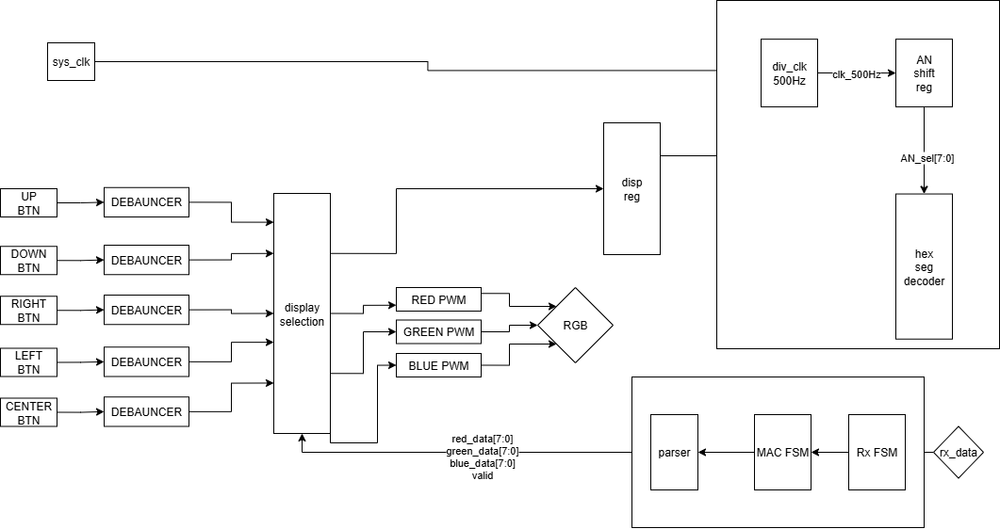

# RGB LED PWM Controller with UART Interface (Lab 6)

## 📌 Overview
This project implements a hardware-based **PWM (Pulse Width Modulation) Controller** for driving RGB LEDs on an FPGA (Nexys Board). The system receives **sRGB** color data via a UART serial interface from a PC, processes the data through Gamma Correction and CIE Scaling, and drives the onboard RGB LEDs accordingly.

In addition to UART control, the system features a local interface using **push-buttons** and a **7-Segment Display** to manually configure and visualize the active color channels and LED selection.

## 🚀 Key Features
* **UART Communication:**
    * Baud Rate: **57600 bps**.
    * Protocol: Receives packetized commands in `{...}` format.
    * Supports pixel setting (`{RGB}`) and LED selection (`{L}`).
* **Signal Processing:**
    * **Gamma Correction:** Translates nonlinear sRGB values to linear LED intensity.
    * **CIE Scaling:** Adjusts brightness to match human eye perception.
* **PWM Generation:**
    * Parametrized resolution (default 1024 steps).
    * Drives two separate RGB LEDs (LED16, LED17).
* **User Interface:**
    * **Debounced Inputs:** 20ms filtering for all push-buttons.
    * **7-Segment Display:** Shows current Red, Green, Blue, and LED Select values in Hex.

## 🛠️ System Architecture
The design is modular, written in **SystemVerilog**, and consists of the following main blocks:

1.  **UART MAC & PHY:**
    * Handles serial reception (RX) and transmission (TX).
    * **Parser FSM:** Decodes incoming byte streams into valid commands/data.
    * Validates frame structure (Start char `{`, Data, End char `}`).
2.  **Display Controller:**
    * Multiplexes the 8-digit 7-segment display.
    * Displays values: `[LED_ID] [RED] [GREEN] [BLUE]`.
3.  **PWM Generators:**
    * Generates variable duty-cycle signals based on the processed color data.
4.  **Control Logic:**
    * Manages state transitions based on Button presses and UART commands.

## 🎮 Operations & Controls

### UART Commands (Serial Terminal)
The system accepts ASCII commands sent via a serial terminal (e.g., Putty/TeraTerm):
* **Set Color:** `{RGB}` -> Sets the Red, Green, and Blue values.
* **Select LED:** `{L}` -> Selects which LED to control (`016` or `017`).

### On-Board Buttons
| Button | Function |
| :--- | :--- |
| **Center** | **Apply:** Updates the PWM controller with the new values. |
| **Right / Left** | **Navigate:** Moves the cursor between R, G, B, and LED Select fields. |
| **Up / Down** | **Modify:** Increments or Decrements the selected value (no wrap-around). |

### 7-Segment Display Mapping
The display shows the current configuration in Hex format:
```text
[ T3 ] [ T2 ] [ T1 ] [ T0 ]
  |      |      |      |
  |      |      |      └── Blue Value
  |      |      └───────── Green Value
  |      └──────────────── Red Value
  └─────────────────────── LED Selector (01=LED16, 10=LED17)
```
## ⚙️ Hardware & Tools
* **FPGA Board:** Nexys A7 (or compatible Xilinx board).
* **Language:** SystemVerilog.
* **Toolchain:** Xilinx Vivado.
* **Clock:** 100 MHz System Clock.
* **Peripherals Used:**
    * 2x RGB LEDs (PWM driven).
    * 8-Digit 7-Segment Display (Time-multiplexed).
    * 5x Push-Buttons (Debounced).
    * USB-UART Interface.

## 📐 System Block Diagram
